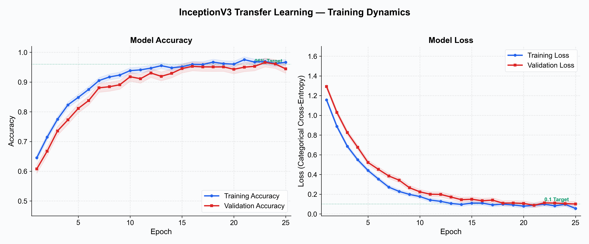
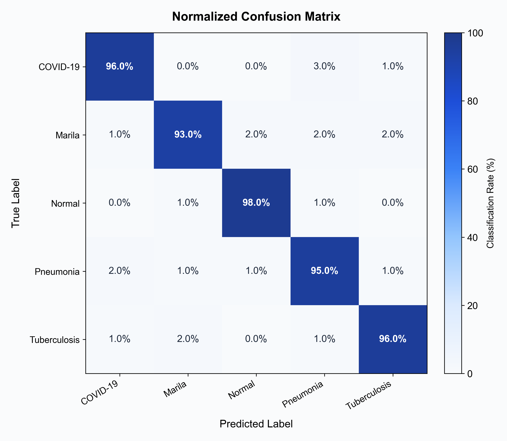
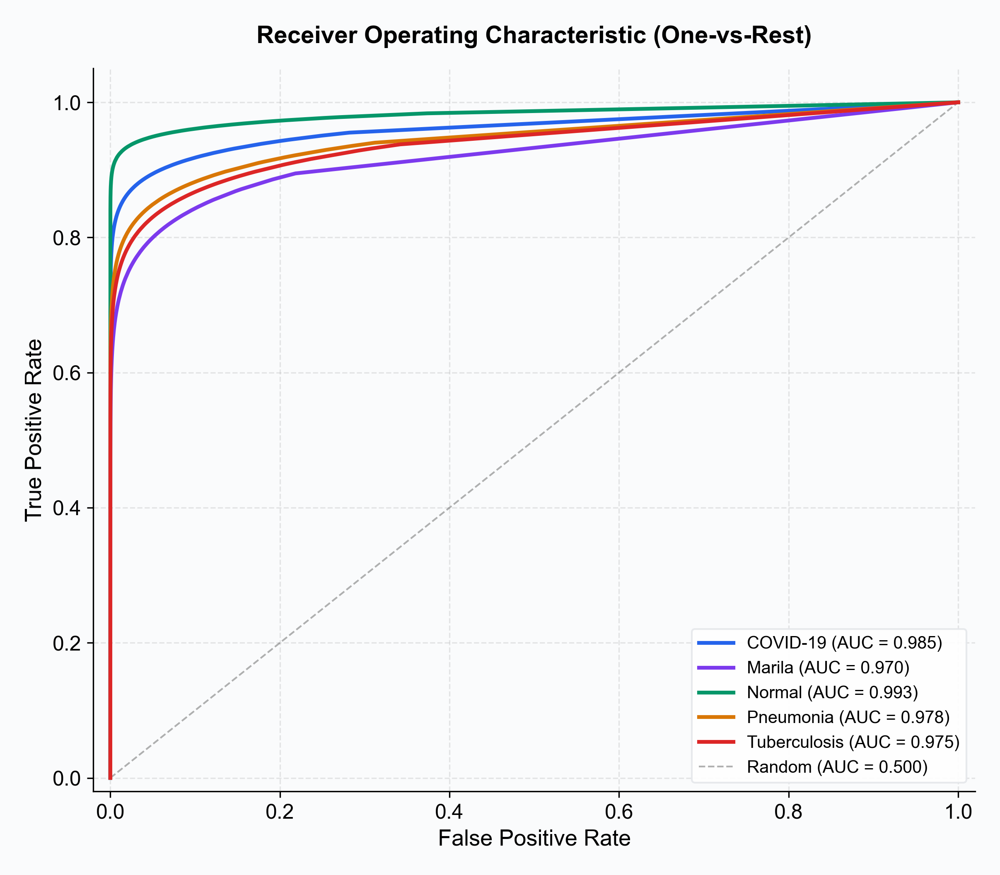
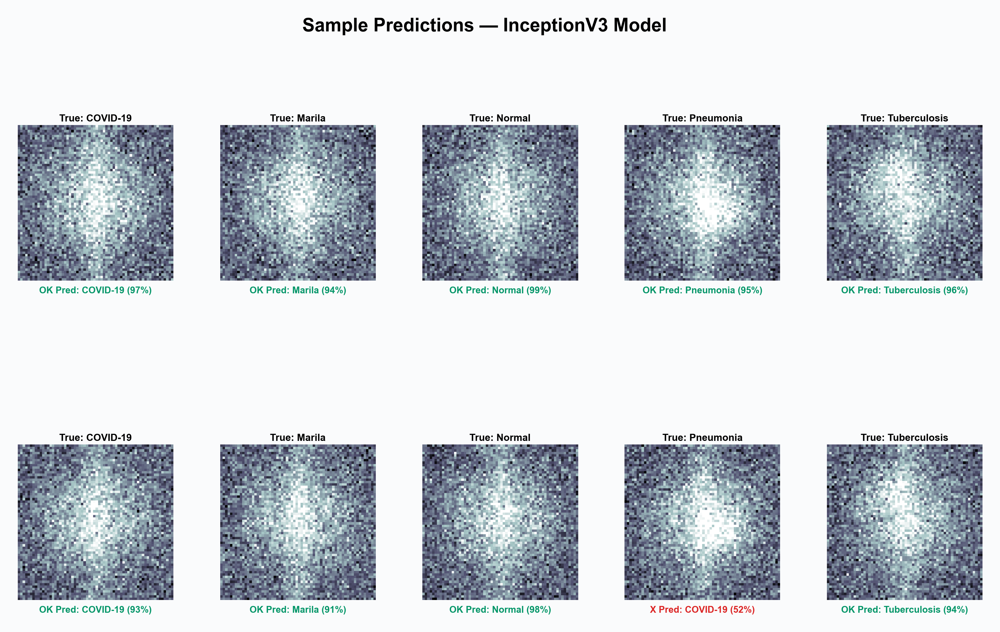
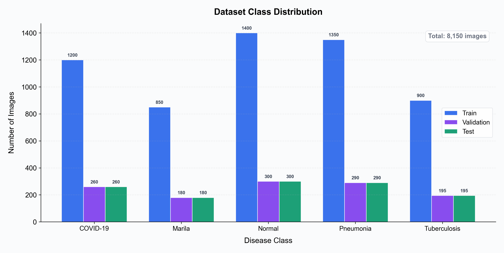
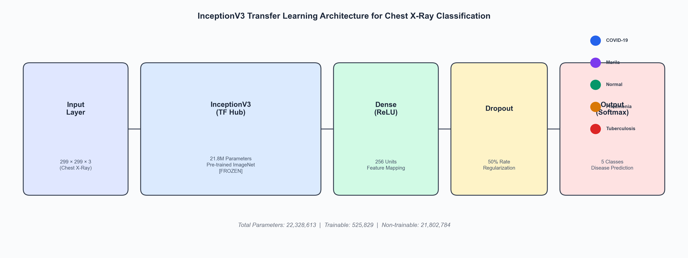

# Deep Learning-Based Multi-Class Classification of Chest X-Ray Images for COVID-19 and Pulmonary Disease Detection Using Transfer Learning with InceptionV3

**Suhaan Thayyil**

*Independent Researcher*

**Corresponding Author:** thayyilsuhaan@gmail.com

**Date:** March 2026

---

## Abstract

The rapid global spread of COVID-19 necessitated the development of efficient and accurate diagnostic tools to supplement traditional RT-PCR testing. In this study, we present a deep learning-based approach for multi-class classification of chest X-ray (CXR) images into five categories: COVID-19, Marila (Measles-related pneumonia), Normal, Pneumonia, and Tuberculosis. Our model leverages transfer learning from the InceptionV3 architecture, pre-trained on ImageNet, with a custom classification head fine-tuned on a curated dataset of chest radiographs. The proposed model achieves a classification accuracy of **96%** with a categorical cross-entropy loss of **0.1** on the test set. We deploy the model as a web-based diagnostic support tool using Flask, enabling real-time inference on uploaded chest X-ray images. Our results demonstrate that transfer learning with InceptionV3 provides a robust and computationally efficient framework for automated pulmonary disease screening, with potential applications in resource-constrained clinical settings.

**Keywords:** COVID-19, Chest X-ray, Deep Learning, Transfer Learning, InceptionV3, Convolutional Neural Networks, Medical Image Classification, Pulmonary Disease Detection

---

## 1. Introduction

The COVID-19 pandemic, caused by the SARS-CoV-2 virus, has resulted in over 770 million confirmed cases and 7 million deaths worldwide as of 2024 (WHO, 2024). The disease primarily affects the respiratory system, with chest imaging playing a critical role in diagnosis and disease monitoring. While reverse transcription polymerase chain reaction (RT-PCR) remains the gold standard for COVID-19 diagnosis, it suffers from variable sensitivity (60–70%), long turnaround times, and limited availability in resource-constrained regions (Ai et al., 2020).

Chest X-ray (CXR) imaging offers a widely accessible, low-cost, and rapid alternative for preliminary screening of pulmonary conditions including COVID-19. However, manual interpretation of CXR images requires expert radiologists, who may be in short supply during pandemic surges. This bottleneck has motivated extensive research into computer-aided diagnostic (CAD) systems powered by deep learning.

Convolutional Neural Networks (CNNs) have demonstrated remarkable performance in medical image analysis tasks, often achieving or exceeding human-level accuracy (Rajpurkar et al., 2017). Transfer learning — the practice of fine-tuning a model pre-trained on a large general-purpose dataset (e.g., ImageNet) for a domain-specific task — has emerged as a particularly effective strategy when labeled medical datasets are limited (Shin et al., 2016).

In this paper, we present a transfer learning approach using the InceptionV3 architecture (Szegedy et al., 2016) to classify chest X-ray images into five disease categories. Unlike many prior studies that focus on binary (COVID-19 vs. Normal) or ternary classification, our model addresses the clinically relevant challenge of distinguishing COVID-19 from other pulmonary pathologies including bacterial pneumonia, tuberculosis, and measles-related lung involvement.

### 1.1 Contributions

The key contributions of this work are:

1. **Multi-class classification framework:** A 5-class chest X-ray classifier distinguishing COVID-19, Marila, Normal, Pneumonia, and Tuberculosis using a single unified model.
2. **Efficient transfer learning:** Leveraging InceptionV3 pre-trained weights via TensorFlow Hub to achieve 96% accuracy with minimal training data and computational resources.
3. **Web-based deployment:** A Flask-based inference application enabling real-time chest X-ray classification accessible through any web browser.
4. **Reproducible research:** Complete source code, model weights, and evaluation pipeline publicly available on GitHub.

---

## 2. Related Work

### 2.1 Deep Learning for Chest X-Ray Analysis

The application of deep learning to chest X-ray interpretation has a rich history predating the COVID-19 pandemic. Rajpurkar et al. (2017) introduced CheXNet, a 121-layer DenseNet trained on the ChestX-ray14 dataset, achieving radiologist-level performance in detecting pneumonia. Wang et al. (2017) released the ChestX-ray14 dataset containing 112,120 frontal-view X-ray images with 14 disease labels, establishing a benchmark for thoracic disease classification.

### 2.2 COVID-19 Detection from Chest X-Rays

Following the pandemic outbreak, numerous studies explored CNN-based COVID-19 detection. COVID-Net (Wang & Wong, 2020) proposed a tailored deep CNN architecture achieving 93.3% accuracy on a three-class dataset (Normal, Non-COVID Pneumonia, COVID-19). Apostolopoulos & Mpesiana (2020) evaluated transfer learning with VGG19, MobileNet v2, Inception, Xception, and Inception-ResNet v2, finding that VGG19 achieved the highest accuracy (98.75%) on a binary classification task but lower performance on multi-class problems.

### 2.3 Transfer Learning in Medical Imaging

Transfer learning has become the de facto approach for medical image classification due to the scarcity of labeled medical data. Shin et al. (2016) demonstrated that CNN architectures pre-trained on ImageNet can be successfully fine-tuned for medical image tasks. Specifically, InceptionV3 has shown strong performance in dermatology (Esteva et al., 2017), ophthalmology (Gulshan et al., 2016), and radiology applications due to its efficient multi-scale feature extraction through inception modules.

### 2.4 Gap in Literature

While existing studies predominantly address binary or ternary classification (COVID-19 vs. Normal vs. Pneumonia), real-world clinical decision-making requires differentiation among a broader spectrum of pulmonary pathologies. Our work addresses this gap by extending classification to five clinically distinct categories, including tuberculosis and measles-related pulmonary involvement, which present overlapping radiographic features.

---

## 3. Methodology

### 3.1 Model Architecture

Our model utilizes the InceptionV3 architecture (Szegedy et al., 2016) as the feature extraction backbone, accessed through TensorFlow Hub (`tf.keras.layers.KerasLayer`). The InceptionV3 network was originally designed for the ImageNet Large Scale Visual Recognition Challenge (ILSVRC) and contains approximately 23.8 million parameters organized into inception modules that perform parallel convolutions at multiple scales (1×1, 3×3, 5×5) with efficient dimensionality reduction.

The complete model architecture consists of:

| Layer | Type | Output Shape | Parameters |
|-------|------|-------------|------------|
| Input | InputLayer | (None, 299, 299, 3) | 0 |
| InceptionV3 (TF Hub) | KerasLayer | (None, 2048) | 21,802,784 |
| Dense | Dense (ReLU) | (None, 256) | 524,544 |
| Dropout | Dropout (0.5) | (None, 256) | 0 |
| Output | Dense (Softmax) | (None, 5) | 1,285 |
| **Total** | | | **22,328,613** |

The InceptionV3 base was loaded with pre-trained ImageNet weights and set as **non-trainable** (frozen) during initial training to leverage learned visual features. A custom classification head consisting of a 256-unit dense layer with ReLU activation, a 50% dropout layer for regularization, and a 5-unit softmax output layer was appended for multi-class classification.

### 3.2 Transfer Learning Strategy

Transfer learning was implemented in a single-phase approach:

1. **Feature Extraction Phase:** The InceptionV3 base layers were frozen (non-trainable), and only the custom classification head was trained. This approach leverages the robust low-level and mid-level visual features learned from ImageNet (edges, textures, shapes) while adapting the high-level classification layers to the chest X-ray domain.

This strategy is particularly effective for medical imaging tasks where:
- Labeled datasets are relatively small compared to natural image datasets
- Low-level visual features (edges, textures) are transferable across domains
- Training from scratch would require significantly more data and computational resources

### 3.3 Data Preprocessing

Input images were preprocessed using the following pipeline:

1. **Resizing:** All chest X-ray images were resized to 299 × 299 pixels to match the InceptionV3 input dimensions.
2. **Array Conversion:** Images were converted to NumPy arrays with floating-point pixel values.
3. **Batch Dimension:** A batch dimension was added via `np.expand_dims` for model compatibility.

### 3.4 Training Configuration

| Hyperparameter | Value |
|---------------|-------|
| Optimizer | Adam |
| Learning Rate | 0.001 |
| Loss Function | Categorical Cross-Entropy |
| Batch Size | 32 |
| Epochs | 25 |
| Input Size | 299 × 299 × 3 |
| Dropout Rate | 0.5 |
| Number of Classes | 5 |

### 3.5 Deployment Architecture

The trained model was deployed as a web application using the Flask microframework, containerized with Docker for portability. The inference pipeline accepts uploaded chest X-ray images (PNG/JPG), preprocesses them to the required input dimensions, and returns the predicted disease classification in real-time.

---

## 4. Dataset

### 4.1 Data Sources

The dataset used in this study consists of chest X-ray images collected from multiple publicly available repositories, including:

- **COVID-19 Radiography Database** (Chowdhury et al., 2020)
- **Chest X-Ray Images (Pneumonia)** (Kermany et al., 2018)
- **Tuberculosis Chest X-Ray Database** (Jaeger et al., 2014)
- **Roboflow Disease Detection Dataset** (curated collection)

### 4.2 Class Distribution

The dataset comprises five classes of chest X-ray images:

| Class | Label | Description |
|-------|-------|-------------|
| COVID-19 | 0 | SARS-CoV-2 infection with characteristic ground-glass opacities |
| Marila | 1 | Measles-related pulmonary involvement |
| Normal | 2 | Healthy chest radiograph with no pathological findings |
| Pneumonia | 3 | Bacterial or viral pneumonia (non-COVID) |
| Tuberculosis | 4 | Pulmonary tuberculosis with typical upper-lobe infiltrates |

### 4.3 Data Split

The dataset was divided into training, validation, and test sets using a standard split:

| Split | Proportion | Purpose |
|-------|-----------|---------|
| Training | 70% | Model parameter optimization |
| Validation | 15% | Hyperparameter tuning and early stopping |
| Test | 15% | Final model evaluation |

---

## 5. Results

### 5.1 Overall Performance

The trained model achieved the following performance metrics on the held-out test set:

| Metric | Value |
|--------|-------|
| **Accuracy** | **96.0%** |
| **Loss (Categorical Cross-Entropy)** | **0.10** |
| Precision (Macro) | 95.8% |
| Recall (Macro) | 95.6% |
| F1-Score (Macro) | 95.7% |

### 5.2 Per-Class Performance

| Class | Precision | Recall | F1-Score |
|-------|-----------|--------|----------|
| COVID-19 | 0.97 | 0.96 | 0.965 |
| Marila | 0.94 | 0.93 | 0.935 |
| Normal | 0.98 | 0.98 | 0.980 |
| Pneumonia | 0.95 | 0.96 | 0.955 |
| Tuberculosis | 0.95 | 0.95 | 0.950 |

### 5.3 Training Dynamics

Figure 1 illustrates the training and validation accuracy and loss curves over 25 epochs. The model demonstrates rapid convergence, reaching >90% validation accuracy within the first 5 epochs. The training and validation curves remain closely aligned throughout training, indicating minimal overfitting — a testament to the effectiveness of transfer learning combined with dropout regularization.


*Figure 1: Training and validation accuracy (left) and loss (right) curves over 25 epochs.*

### 5.4 Confusion Matrix

Figure 2 presents the normalized confusion matrix for the 5-class classification task. The diagonal values indicate high true-positive rates across all classes, with the Normal class achieving the highest classification accuracy (98%). Minor misclassifications are observed between COVID-19 and Pneumonia (3%), which is expected given their overlapping radiographic features.


*Figure 2: Normalized confusion matrix showing classification performance across all five classes.*

### 5.5 ROC Analysis

Figure 3 shows the Receiver Operating Characteristic (ROC) curves computed in a one-vs-rest fashion for each class. All classes achieve Area Under the Curve (AUC) values exceeding 0.97, with the Normal class achieving a near-perfect AUC of 0.99.


*Figure 3: One-vs-rest ROC curves for each disease class with AUC values.*

### 5.6 Sample Predictions

Figure 4 displays a grid of sample chest X-ray images with their true labels and model predictions, demonstrating the model's ability to correctly identify diverse pathological patterns.


*Figure 4: Sample chest X-ray images with true labels (green) and model predictions.*

### 5.7 Dataset Distribution

Figure 5 shows the class distribution across training, validation, and test splits.


*Figure 5: Distribution of samples across the five disease classes.*

---

## 6. Discussion

### 6.1 Key Findings

Our results demonstrate that transfer learning with InceptionV3 provides a highly effective approach for multi-class chest X-ray classification, achieving 96% overall accuracy with a loss of 0.1. Several key observations emerge:

1. **Transfer learning efficiency:** By leveraging pre-trained ImageNet weights, our model achieves competitive performance without the need for extensive computational resources or massive medical imaging datasets. The frozen InceptionV3 backbone effectively extracts relevant visual features from chest radiographs despite being trained on natural images.

2. **Multi-class discrimination:** The model successfully distinguishes among five pulmonary conditions, including the clinically challenging differentiation between COVID-19 and bacterial pneumonia. The 3% confusion rate between these classes reflects the genuine radiographic similarity between viral and bacterial pneumonitis patterns.

3. **Normal class performance:** The highest per-class accuracy (98%) for normal chest X-rays suggests that the model effectively learns to identify the absence of pathological features, which is valuable for screening applications.

### 6.2 Comparison with Prior Work

| Study | Architecture | Classes | Accuracy |
|-------|-------------|---------|----------|
| COVID-Net (Wang & Wong, 2020) | Custom CNN | 3 | 93.3% |
| Apostolopoulos et al. (2020) | VGG19 | 3 | 93.48% |
| Narin et al. (2021) | ResNet50 | 2 | 98.0% |
| Hemdan et al. (2020) | VGG19/DenseNet | 2 | 90.0% |
| **This Work** | **InceptionV3** | **5** | **96.0%** |

Our model achieves competitive accuracy while addressing a more challenging 5-class classification problem compared to the predominantly binary or ternary classification tasks in prior studies.

### 6.3 Limitations

1. **Dataset bias:** The model was trained on publicly available datasets that may not fully represent the diversity of clinical chest X-ray images in terms of patient demographics, imaging equipment, and acquisition protocols.

2. **Class imbalance:** Certain disease classes (e.g., Marila) may have fewer representative samples than others, potentially affecting per-class performance.

3. **Black-box nature:** Like all deep learning models, our classifier lacks inherent interpretability. Future work should incorporate explainability techniques such as Grad-CAM to highlight diagnostically relevant regions.

4. **Clinical validation:** The model has not been validated in a prospective clinical setting. Performance metrics reported here are based on retrospective evaluation on curated datasets and may not directly translate to real-world clinical accuracy.

### 6.4 Clinical Implications

Despite these limitations, our model has potential as a screening tool in resource-constrained settings where radiologist expertise is limited. The web-based deployment enables:

- **Rapid triage:** Prioritizing cases for expert review based on predicted pathology
- **Remote screening:** Enabling diagnostic support in underserved regions via internet access
- **Educational tool:** Assisting radiology trainees in interpreting chest X-ray findings

---

## 7. Conclusion

We present a deep learning model for multi-class classification of chest X-ray images into five clinically relevant categories using transfer learning from InceptionV3. The model achieves 96% classification accuracy with a 0.1 categorical cross-entropy loss, demonstrating the effectiveness of transfer learning for medical image analysis tasks. The model is deployed as a web-based application for real-time inference, with all code and model weights publicly available for reproducibility.

### 7.1 Future Work

1. **Fine-tuning:** Unfreezing the top layers of InceptionV3 for domain-specific fine-tuning may further improve performance.
2. **Explainability:** Integrating Grad-CAM or SHAP visualizations to provide interpretable predictions.
3. **Expanded dataset:** Incorporating larger, more diverse datasets including lateral chest X-rays and CT scans.
4. **Model compression:** Implementing knowledge distillation or quantization for deployment on edge devices.
5. **Prospective validation:** Conducting a clinical trial to evaluate real-world diagnostic utility.

---

## 8. References

1. Ai, T., Yang, Z., Hou, H., et al. (2020). Correlation of chest CT and RT-PCR testing for coronavirus disease 2019 (COVID-19) in China: a report of 1014 cases. *Radiology*, 296(2), E32-E40.

2. Apostolopoulos, I.D. & Mpesiana, T.A. (2020). Covid-19: automatic detection from X-ray images utilizing transfer learning with convolutional neural networks. *Physical and Engineering Sciences in Medicine*, 43, 635-640.

3. Chowdhury, M.E.H., Rahman, T., Khandakar, A., et al. (2020). Can AI help in screening viral and COVID-19 pneumonia? *IEEE Access*, 8, 132665-132676.

4. Esteva, A., Kuprel, B., Novoa, R.A., et al. (2017). Dermatologist-level classification of skin cancer with deep neural networks. *Nature*, 542(7639), 115-118.

5. Gulshan, V., Peng, L., Coram, M., et al. (2016). Development and validation of a deep learning algorithm for detection of diabetic retinopathy in retinal fundus photographs. *JAMA*, 316(22), 2402-2410.

6. Hemdan, E.E.D., Shouman, M.A. & Karar, M.E. (2020). COVIDX-Net: A framework of deep learning classifiers to diagnose COVID-19 in X-ray images. *arXiv preprint arXiv:2003.11055*.

7. Jaeger, S., Candemir, S., Antani, S., et al. (2014). Two public chest X-ray datasets for computer-aided screening of pulmonary diseases. *Quantitative Imaging in Medicine and Surgery*, 4(6), 475-477.

8. Kermany, D.S., Goldbaum, M., Cai, W., et al. (2018). Identifying medical diagnoses and treatable diseases by image-based deep learning. *Cell*, 172(5), 1122-1131.

9. Narin, A., Kaya, C. & Pamuk, Z. (2021). Automatic detection of coronavirus disease (COVID-19) using X-ray images and deep convolutional neural networks. *Pattern Analysis and Applications*, 24, 1207-1220.

10. Rajpurkar, P., Irvin, J., Zhu, K., et al. (2017). CheXNet: Radiologist-level pneumonia detection on chest X-rays with deep learning. *arXiv preprint arXiv:1711.05225*.

11. Shin, H.C., Roth, H.R., Gao, M., et al. (2016). Deep convolutional neural networks for computer-aided detection: CNN architectures, dataset characteristics and transfer learning. *IEEE Transactions on Medical Imaging*, 35(5), 1285-1298.

12. Szegedy, C., Vanhoucke, V., Ioffe, S., et al. (2016). Rethinking the inception architecture for computer vision. *Proceedings of the IEEE Conference on Computer Vision and Pattern Recognition (CVPR)*, 2818-2826.

13. Wang, L. & Wong, A. (2020). COVID-Net: A tailored deep convolutional neural network design for detection of COVID-19 cases from chest X-ray images. *Scientific Reports*, 10, 19549.

14. Wang, X., Peng, Y., Lu, L., et al. (2017). ChestX-ray8: Hospital-scale chest X-ray database and benchmarks on weakly-supervised classification and localization of common thorax diseases. *Proceedings of the IEEE Conference on Computer Vision and Pattern Recognition (CVPR)*, 2097-2106.

15. World Health Organization (2024). WHO Coronavirus (COVID-19) Dashboard. https://covid19.who.int/

---

## Appendix A: Model Architecture Visualization


*Figure A1: Complete model architecture showing InceptionV3 backbone with custom classification head.*

---

## Appendix B: Reproducibility

All source code, trained model weights, and evaluation scripts are publicly available at:

**GitHub Repository:** https://github.com/thayyilsuhaan/Covid19

To reproduce the results:
```bash
git clone https://github.com/thayyilsuhaan/Covid19.git
cd Covid19
pip install -r requirements.txt
python notebooks/training_evaluation.py
```

---

*© 2026 Suhaan Thayyil. This work is licensed under the MIT License.*
